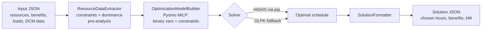

# MILP Energy Resource Optimizer

[](https://github.com/xxsnz/energy-optimization-milp/actions/workflows/ci.yml)
[](pyproject.toml)
[](LICENSE)

Mixed-Integer Linear Programming optimizer for scheduling energy assets across
demand-response programs to maximize financial benefits.

## Overview

The optimizer schedules energy resources (batteries, generators, loads) across
three program types:

- **ECON** — economic demand response
- **FR** — frequency regulation
- **DCM** — demand capacity management

It builds a MILP model with [Pyomo](https://www.pyomo.org/) and solves it with
[HiGHS](https://highs.dev/) (pip-installable, no system packages needed) or
GLPK, maximizing total benefit subject to capacity limits, energy budgets,
mutual exclusivity rules, and consecutive-hour requirements.

### Why this project

Scheduling flexible energy assets across competing revenue programs is a
combinatorial problem: every hour, every asset must pick at most one program,
budgets couple decisions across the whole year, and programs impose their own
shape rules (consecutive hours, eligible-hour chains). This repo shows how to
express that cleanly as a MILP — including a pre-solve dominance analysis that
prunes the search space before the solver runs — and wrap it in a tested,
typed, pip-installable Python package.

## Installation

```bash
python3 -m venv .venv
source .venv/bin/activate
pip install -e .
```

This installs Pyomo and the HiGHS solver — nothing else is required. GLPK
(`glpsol` in `PATH`) is supported as an alternative solver.

## Usage

```bash
energy-optimizer examples/case3.json
# Writes examples/case3_sln.json
```

For `examples/case3.json` (a battery and a generator competing across two
summer months) the optimizer produces a schedule like:

```text
battery-01     econ  month 1: hours [1, 2, 3, 4]  benefit 1055.75
battery-01     fr    month 0: hours [0]           benefit  150.00
battery-01     fr    month 1: hours [0, 5, 6, 7]  benefit  806.75
generator-01   econ  month 0: hours [1, 2, 3, 4]  benefit 1421.25
generator-01   econ  month 1: hours [1, 2, 3, 4]  benefit 1465.75
                                            total benefit 4899.50
```

The battery splits its 6 hour-equivalent energy budget between high-value ECON
peaks and cheap FR hours (FR only consumes 35 % of an hour-equivalent), while
the generator takes the ECON peaks its 8-hour limit allows.

Options:

```text
usage: optimizer [-h] [-o OUTPUT] [--solver {highs,glpk}]
                 [--strategy {simple_math,asset_level}]
                 [--time-limit TIME_LIMIT] [--mip-gap MIP_GAP]
                 input_file

  -o, --output      Path to the solution JSON file (default: <input>_sln.json)
  --solver          MILP solver (default: auto-detect, HiGHS preferred)
  --strategy        Optimization strategy (default: asset_level)
  --time-limit      Solver time limit in seconds (default: 200)
  --mip-gap         Relative MIP optimality gap (default: 0.01)
```

## How It Works



The package mirrors that flow, one module per stage:

| Module | Responsibility |
|--------|----------------|
| `energy_optimizer.config` | Run configuration, solver auto-detection |
| `energy_optimizer.domain` | Shared vocabulary: programs, asset types, time encoding |
| `energy_optimizer.extraction` | Input JSON → `ResourceConstraints` (benefits, limits, dominance and exclusivity relations) |
| `energy_optimizer.model` | Pyomo model: binary `x[asset_program, period_hour]` participation vars, auxiliary binaries (`y`, `z`, `i`) for DCM activation and consecutive-hour rules, objective `max Σ benefit · x` |
| `energy_optimizer.runner` | Orchestration: load → extract → build → solve → format → write |
| `energy_optimizer.formatting` | Solver output → solution JSON schema |
| `energy_optimizer.cli` | argparse interface, logging setup |

### Model highlights

- **Time encoding**: `"{period}_{hour}"` keys (e.g. `"0_5"` = period 0, hour 5),
  with `"0_0"` as the "no participation" sentinel
- **Benefit-based dominance**: for each hour, precompute whether ECON or FR pays
  more and constrain the loser to zero — shrinks the search space before the
  solver ever runs
- **Consecutive hours**: FR and ECON participation requires 2+ consecutive
  hours, enforced through chained auxiliary variables
- **DCM chain**: participation restricted to pre-specified eligible hours
  per asset

## Input / Output

Input JSON (see `examples/`):

- `Resources` — assets with capacities, limits, and per-program hourly benefits
- `MonthlyLoads` — hourly load profiles per period
- `DcmData` — DCM hour-eligibility and kW ranges per asset
- `ExcludeFirstDcmMonth` — whether to block DCM in the first period

Solution JSON:

- `Resources` — per-asset program participation (chosen hours, benefit, total kW)
- `Dcm` — DCM activation counts per period
- `DcmHrs` — selected DCM hours per asset per period

## Development

```bash
pip install -e ".[dev]"

pytest                                    # run the test suite
pytest --cov=energy_optimizer             # with coverage
ruff check .                              # lint
mypy energy_optimizer                     # type-check
```

The test suite covers configuration, data extraction, edge cases, end-to-end
optimization runs on the example cases, and property-based invariant checks
([Hypothesis](https://hypothesis.readthedocs.io/)) that verify every solution
respects mutual exclusivity, energy budgets, and benefit accounting for
randomly generated inputs. It runs in a few seconds with no system solver
installed. See [tests/README.md](tests/README.md).

## License

MIT — see [LICENSE](LICENSE).
